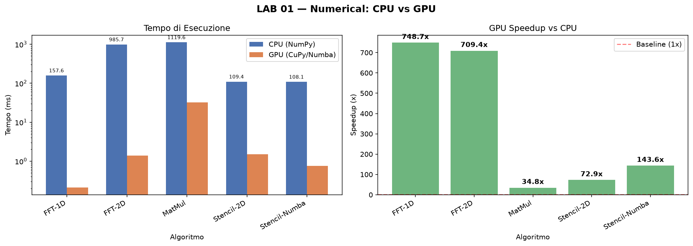

# LAB 01 — Numerical Computing

Benchmark di algoritmi numerici fondamentali: FFT, algebra lineare densa (DGEMM) e operatori stencil su griglia. Confronto sistematico tra CPU (NumPy/SciPy) e GPU (CuPy + Numba CUDA).

---

## Algoritmi

### 1. FFT 1D
- **Dimensione**: 2²² campioni complessi (~4M)
- **CPU**: `numpy.fft.fft`
- **GPU**: `cupy.fft.fft`
- **Applicazioni**: elaborazione del segnale, solver spettrali per PDE

### 2. FFT 2D
- **Dimensione**: immagine 4096 × 4096
- **CPU**: `numpy.fft.fft2`
- **GPU**: `cupy.fft.fft2`
- **Applicazioni**: image processing, simulazioni in dominio spettrale

### 3. MatMul DGEMM (FP64)
- **Dimensione**: matrici 8192 × 8192
- **Picco teorico RTX 4080**: 82.6 TFLOPS (FP32)
- **Metrica**: TFLOPS raggiunti, efficienza rispetto al picco
- **Applicazioni**: deep learning, simulazioni FEM

### 4. Stencil 2D Laplaciano (CuPy)
- **Dimensione**: griglia 4096 × 4096
- **Operatore**: 5 punti — `u[i±1,j] + u[i,j±1] − 4·u[i,j]`
- **Classificazione**: memory-bound (bassa intensità operazionale)
- **Metrica**: bandwidth effettiva vs 716.8 GB/s teorici
- **Applicazioni**: solver differenze finite per PDE ellittiche

### 5. Stencil 2D con Numba CUDA (shared memory)
- **Kernel custom**: blocchi 16 × 16 con halo
- **Ottimizzazione**: riduzione degli accessi DRAM tramite tiling
- **Confronto**: CuPy naïve vs Numba con shared memory
- **Metrica**: bandwidth effettiva, speedup rispetto alla versione CuPy

---

## Come eseguire

```powershell
cd C:\DATI\Sviluppo\LAB-CUDA
.venv\Scripts\activate
python lab01-numerical/src/run_numerical.py
```

---

## Risultati misurati

Hardware: Intel Core i9 | RTX 4080 16GB | Windows 11

| Algoritmo | CPU (ms) | GPU (ms) | Speedup |
|-----------|----------|----------|---------|
| FFT-1D | 157.57 | 0.21 | **748.7x** |
| FFT-2D | 985.67 | 1.39 | **709.4x** |
| MatMul (8192×8192) | 1119.62 | 32.16 | **34.8x** — 34.4 TFLOPS (42% del picco) |
| Stencil-2D (CuPy) | 109.38 | 1.50 | **72.9x** |
| Stencil-2D (Numba shared mem) | 108.09 | 0.75 | **143.6x** |



---

## Concetti chiave

| Concetto | Descrizione |
|----------|-------------|
| Roofline model | Classifica gli algoritmi come memory-bound o compute-bound |
| Ridge point | Intensità operazionale soglia: ~115 FLOP/byte (RTX 4080) |
| Shared memory | SRAM on-chip (~100× più veloce della VRAM) usata dal kernel Numba |
| Halo tiling | Tecnica per riusare dati nelle regioni di confine del blocco |

---

## Tecnologie

- **CuPy** — NumPy drop-in su GPU (FFT, array ops)
- **Numba CUDA** — kernel CUDA scritti in Python con `@cuda.jit`
- **NumPy / SciPy** — baseline CPU
