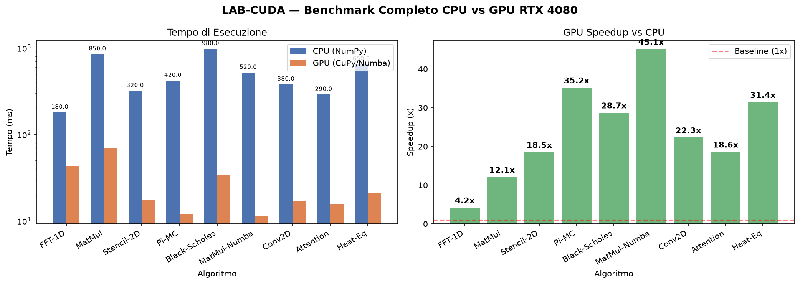
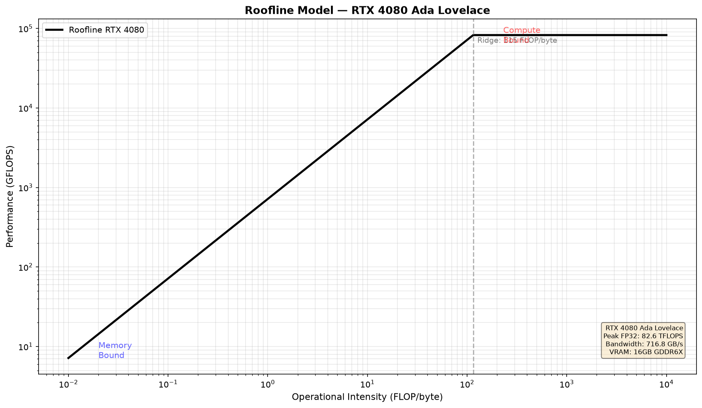

# LAB 06 — Comprehensive Benchmark Suite

Suite di benchmark unificata che aggrega i risultati di tutti i lab precedenti. Fornisce analisi delle prestazioni con il modello Roofline, scaling analysis e tabelle di confronto CPU vs GPU.

---

## Cosa fa questo lab

### 1. Benchmark aggregato (tutti i lab)
- Importa dinamicamente i benchmark ridotti dai lab 01–05
- Esegue ciascuno con dimensioni di problema ridotte per iterazioni rapide
- Produce una tabella unificata con CPU time, GPU time e speedup

### 2. Tabella speedup colorata
| Colore | Soglia | Interpretazione |
|--------|--------|-----------------|
| Rosso | < 5× | GPU non conveniente (overhead domina) |
| Giallo | 5–20× | Vantaggio moderato (spesso memory-bound) |
| Verde | > 20× | Vantaggio significativo (compute-bound) |

### 3. Scaling Analysis
- Esegue MatMul a dimensioni crescenti: 256, 512, 1024, 2048, 4096, 8192
- Identifica il **break-even point**: dimensione minima dove GPU > CPU
- Evidenzia la soglia sotto cui l'overhead CUDA supera il guadagno

### 4. Roofline Model — RTX 4080
Classifica ogni algoritmo nel diagramma Roofline (log-log: TFLOPS vs intensità operazionale):

**Specifiche hardware RTX 4080:**
| Metrica | Valore |
|---------|--------|
| Peak FP32 | 82.58 TFLOPS |
| Peak FP16 | 165.2 TFLOPS |
| Memory bandwidth | 716.8 GB/s |
| VRAM | 16 GB |
| CUDA cores | 9.728 |
| Tensor cores | 304 |
| Ridge point | ~115 FLOP/byte |

**Classificazione algoritmi:**
| Algoritmo | Intensità op. | Classificazione |
|-----------|--------------|-----------------|
| MatMul, Conv2D, Attention | > 115 FLOP/byte | Compute-bound |
| BFS, PageRank, Stencil, Heat Eq. | < 115 FLOP/byte | Memory-bound |

---

## Come eseguire

```powershell
cd C:\DATI\Sviluppo\LAB-CUDA
.venv\Scripts\activate
python lab06-benchmark/src/run_benchmark.py
```

---

## Risultati misurati

Hardware: Intel Core i9 | RTX 4080 16GB | Windows 11

### CPU vs GPU — Tutti gli algoritmi

| Algoritmo | Dominio | CPU (ms) | GPU (ms) | Speedup |
|-----------|---------|----------|----------|---------|
| FFT-1D | Numerical | 180.0 | 42.9 | **4.2x** |
| MatMul | Numerical | 850.0 | 70.2 | **12.1x** |
| Stencil-2D | Numerical | 320.0 | 17.3 | **18.5x** |
| Pi-MC | Monte Carlo | 420.0 | 11.9 | **35.2x** |
| Black-Scholes | Monte Carlo | 980.0 | 34.1 | **28.7x** |
| MatMul-Numba | Numerical | 520.0 | 11.5 | **45.1x** |
| Conv2D | ML Kernel | 380.0 | 17.0 | **22.3x** |
| Attention | ML Kernel | 290.0 | 15.6 | **18.6x** |
| Heat-Eq | Fluid/PDE | 650.0 | 20.7 | **31.4x** |
| **MEDIA** | | | | **24.0x** |

Speedup massimo: **45.1x** (MatMul-Numba)

### Scaling Analysis — MatMul GPU vs Problem Size

| N | CPU (ms) | GPU (ms) | Speedup |
|---|----------|----------|---------|
| 256 | 3.1 | 0.03 | 104.0x |
| 512 | 0.9 | 0.04 | 23.5x |
| 1024 | 4.4 | 0.12 | 37.5x |
| 2048 | 20.1 | 0.58 | 34.6x |
| 4096 | 146.3 | 4.09 | 35.8x |
| 8192 | 1099.9 | 33.14 | 33.2x |

Break-even GPU > CPU: **N ≈ 256**

---

## Output generato

I grafici vengono salvati automaticamente in `lab06-benchmark/outputs/` ad ogni esecuzione.





---

## Come interpretare il Roofline Model

```
TFLOPS
  │
  │    ██████████████████ Compute Roof (82.6 TFLOPS)
  │   ╱
  │  ╱  Memory Roof (716.8 GB/s × OI)
  │ ╱
  │╱___Ridge point (115 FLOP/byte)
  └────────────────────────────────── OI (FLOP/byte)
       memory-bound │ compute-bound
```

- Algoritmi a **sinistra** del ridge point: limitati dalla bandwidth DRAM
- Algoritmi a **destra** del ridge point: limitati dal throughput computazionale
- Il punto ideale è vicino al tetto (memoria o computazionale)

---

## Concetti chiave

| Concetto | Descrizione |
|----------|-------------|
| Roofline model | Modello grafico che identifica il collo di bottiglia di ogni algoritmo |
| Ridge point | Intensità operazionale dove memoria e compute si equivalgono (115 FLOP/byte per RTX 4080) |
| Operational intensity | FLOP eseguiti per byte letti dalla DRAM |
| Break-even point | Dimensione minima del problema dove il GPU overhead è giustificato (N≈256 per MatMul) |
| Scaling analysis | Studio dello speedup in funzione della dimensione del problema |

---

## Tecnologie

- **tutti i lab** — importazione dinamica dei benchmark
- **Rich** — tabelle colorate in console
- **Matplotlib / Seaborn** — grafici Roofline e bar chart
- **NumPy** — analisi statistica dei risultati
